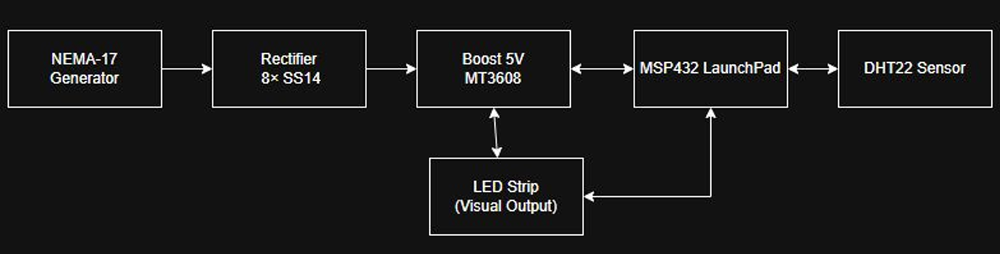

# Self-sustaining Environmental Patrol Robot – ECE 528 Final Project

This project combines energy harvesting and autonomous robotics.  
A small DC motor is used as a generator to create 5 V power, which runs an MSP432-based robot that patrols its environment and monitors humidity.

---

## Author

**Juan Zendejas and Kaito Fukuyama**  
Instructor: Professor Aaron Nanas  
Course: ECE 528 – Embedded System Design  
Semester: Fall 2025  

---

## Introduction

This project implements a **self-sustaining environmental patrol robot**.  
The system has two main parts:

1. **Energy Harvesting Front-End**  
   - A DC motor is driven externally (e.g., by a drill) and used as a generator.  
   - Each motor lead is fed into its own full-bridge rectifier built from Schottky diodes.  
   - The rectified outputs are filtered using capacitors and then regulated by an LM2596 buck converter, adjusted to **5 V**.  
   - The 5 V output powers the MSP432 LaunchPad through a USB-A connector, demonstrating how harvested energy can run the controller.

2. **Environmental Patrol Robot**  
   - An MSP432P401R LaunchPad on a TI-RSLK chassis uses three Sharp GP2Y0A21YK0F distance sensors to navigate a hallway.  
   - The robot follows walls using a proportional controller and slows or redirects when objects are too close.  
   - A DHT22 sensor monitors ambient temperature and humidity.  
   - A PWM-driven LED and UART terminal messages form a simple **irrigation state machine** that classifies the environment as STARTUP, OK, DRY, or VERY DRY.

Together, these subsystems show how embedded systems can tie together **energy harvesting, sensing, and autonomous motion** in a compact platform.

---

## 2. Functional Block Diagram

  
*Figure 1: Energy from the generator is rectified, regulated to 5 V, and used to power the MSP432, sensors, and robot chassis.*

---

## Results and Video Demonstration

The final prototype successfully:

- Harvests energy from the DC motor and regulates it to 5 V using the LM2596 buck converter.
- Powers the MSP432 LaunchPad entirely from the harvested 5 V supply.
- Uses three IR distance sensors for wall following and object detection.
- Reads temperature and humidity from the DHT22 and maps humidity to an irrigation state machine:
  - **OK** – acceptable moisture  
  - **DRY** – early warning  
  - **VERY DRY** – irrigation strongly recommended
- Reports sensor values and state over the UART terminal.
- Uses a PWM LED to visually indicate the current irrigation state.

**Demo Videos :**

- Energy harvesting and power chain:  
  `https://youtube.com/shorts/bpxP3ixZ84w?feature=share`
- Patrol behavior and wall following:  
  `https://youtube.com/shorts/vx2ME-NlFOU?feature=share`
- DHT22 readings + state machine output over UART:  
  `https://youtu.be/DQGt3XiO_hc`

---

## 4. Background and Methodology

This project was designed to combine **power electronics** and **embedded control** in a single platform.

### 4.1 Embedded Programming Principles Applied

- **Polling (bit-level I/O)**  
  Used to communicate with the DHT22 sensor by timing the pulse widths for each bit on the data line.

- **SysTick Timer**  
  Configured to generate periodic interrupts at 100 Hz, which drive the wall-follower control loop.

- **GPIO-based Digital Input/Output**  
  Used to interface with nearly every component in the project, including the DHT22 data line and LED indicators.

- **GPTM / Timer A1**  
  Configured to generate 2 kHz periodic interrupts that trigger ADC sampling for the three analog distance sensors.

- **Interrupts**  
  Used with SysTick and Timer A1 to decouple sensor sampling and control tasks from the main application loop.

- **State-Based Logic**  
  An irrigation state machine (STARTUP, OK, DRY, VERY DRY) uses humidity readings to update both a PWM LED and UART status messages.

### 4.2 How the Project Goals Were Achieved

1. **Power Stage**  
   The DC motor generator feeds two full-bridge rectifiers built from Schottky diodes.  
   Capacitors smooth the rectified voltage, and an LM2596 buck converter is tuned to output a regulated 5 V rail.  
   This 5 V line powers the MSP432 LaunchPad over micro-USB and lights the on-board LED102 when power is present.

2. **Wall-Following Control (Controller_1)**  
   Timer A1 periodically triggers ADC conversions on the left, center, and right IR sensors.  
   The raw readings are passed through digital low-pass filters and then converted into distance in millimeters.  
   `Controller_1()` is called from the SysTick interrupt at 100 Hz.  
   It compares the left and right distances to a desired setpoint (~250 mm), computes an error, and adjusts the left and right PWM duty cycles.  
   This lets the robot track along a wall instead of drifting into it or away from it.

3. **Environmental Monitoring and Irrigation Logic**  
   In the main loop, the firmware periodically calls `DHT22_Read()` to obtain temperature and humidity.  
   - `Irrigation_UpdateState()` maps humidity into OK, DRY, or VERY DRY.  
   - `Irrigation_ApplyOutputs()` sets the PWM duty cycle on P2.4 and prints formatted messages to the UART terminal.  
   This provides a simple visualization of how dry the environment is while the robot patrols.

---

## 5. Components Used

| Component                           | Function                                                      |
|------------------------------------|---------------------------------------------------------------|
| MSP432P401R LaunchPad              | Main microcontroller; runs sensing, control, and UART output |
| TI-RSLK MAX chassis + DC motors    | Mobile base for patrol and wall-following                    |
| DC motor (used as generator)       | Mechanical input converted to electrical energy              |
| Dual full-bridge rectifiers        | Rectify the generator’s AC output to DC                      |
| Electrolytic capacitors (2200–4700 µF) | Smooth rectified voltage and store harvested energy      |
| LM2596 buck converter module       | Steps variable DC bus down to regulated 5 V                  |
| DHT22 temperature/humidity sensor  | Measures ambient temperature and relative humidity           |
| 3× GP2Y0A21YK0F IR distance sensors| Provide left, center, and right distance for navigation      |
| LED on P2.4 (PWM)                  | Irrigation state indicator (brightness encodes dryness)      |
| LED102 (on-board)                  | Indicates that 5 V power is present on the LaunchPad         |
| Misc. wiring, connectors, perfboard| Connects power stage, LaunchPad, and sensors                 |

---

## 6. Pinout Used

| Function                     | Component            | Pin(s)        | Description                                                  |
|------------------------------|----------------------|---------------|--------------------------------------------------------------|
| DHT22 Data Line              | DHT22 Sensor         | P1.7          | Reads temperature and humidity via GPIO                     |
| PWM Irrigation Indicator LED | Status LED           | P2.4 (TA0.1)  | Timer_A0.1 PWM; LED brightness shows irrigation state       |
| Left GP2Y0A21YK0F            | Left IR Distance     | P9.1 (A17)    | ADC14 input for left distance sensor                        |
| Right GP2Y0A21YK0F           | Right IR Distance    | P9.0 (A14)    | ADC14 input for right distance sensor                       |
| Center GP2Y0A21YK0F          | Center IR Distance   | P6.1 (A16)    | ADC14 input for front/center obstacle detection             |
| LM2596 5 V Output            | 5 V buck converter   | micro-USB     | Powers the MSP432 LaunchPad at 5 V                          |
| LED102                       | Green on-board LED   | On-board      | Indicates that 5 V is present on the LaunchPad              |
